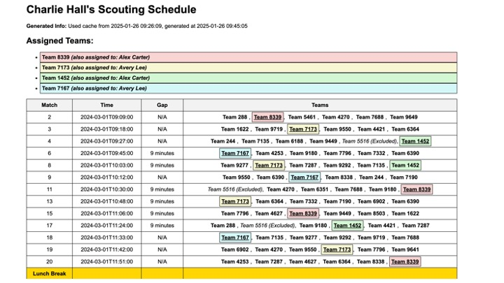
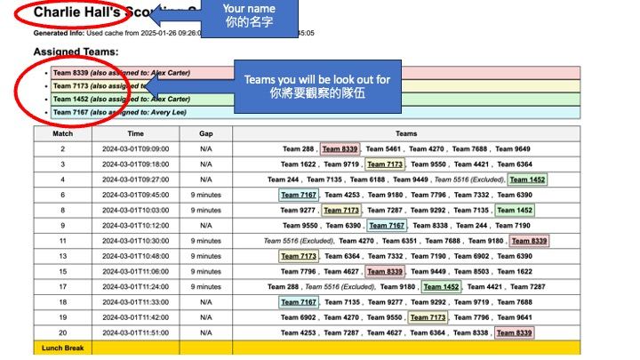
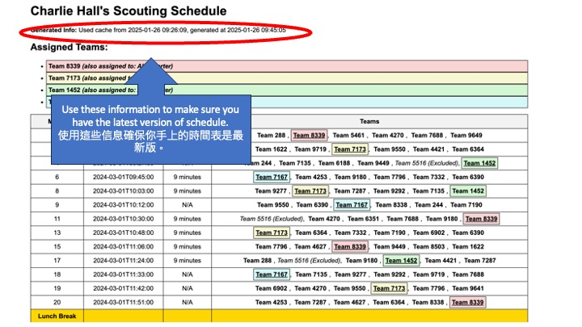
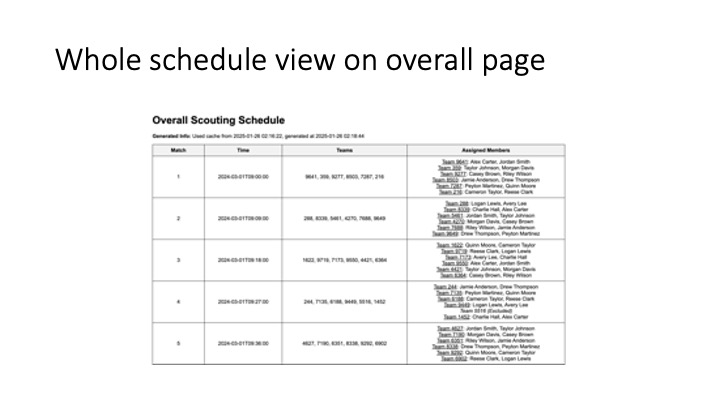
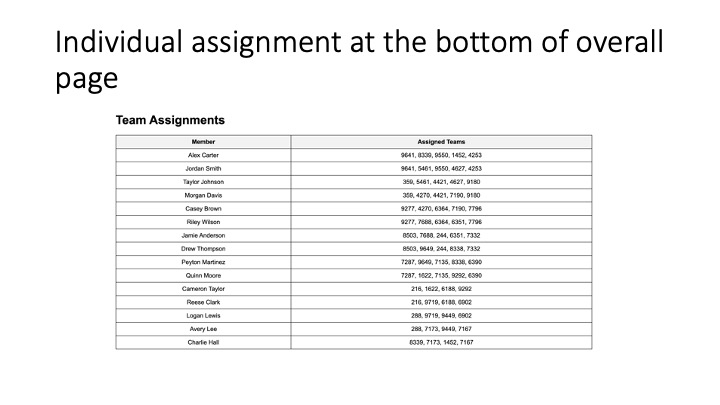

# FRC Scouting Scheduler

This script helps generate scouting schedules for an FRC (FIRST Robotics Competition) event. It retrieves match schedules from the **FIRST API**, assigns students to scout teams, and produces:

1. An **overall schedule** (including assigned members for each match).  
2. **Individual schedules** for each member, showing exactly which team they should scout in each match.

## This  software contain AI generated content

 Use at your precaution.
## Slide 1


## Slide 2


## Slide 3


## Slide 4


## Slide 5


## Slide 6


## Slide 7


## Slide 8


## Slide 9


## Slide 10


## Slide 11


## Slide 12


## Slide 13


## Slide 14


## Slide 15


## Slide 16


## Slide 17


## Key Features

- **Automatic Data Fetching**  
  - Connects to the [FRC API](https://frc-events.firstinspires.org/services/api) to retrieve the official match schedule.
  - Caches data locally in a JSON file to minimize API calls when desired.

- **Team Assignment Logic**  
  - Excludes certain teams from scouting (via a configurable `EXCLUDED_TEAMS` list).
  - Enforces a minimum number of members per team (`MIN_MEMBERS_PER_TEAM`) and a minimum number of teams per member (`MIN_TEAMS_PER_MEMBER`).
  - Prevents multiple teams in the same match from being assigned to a single member (each member scouts only one team per match).

- **Lunch Break & Overnight Detection**  
  - If the gap between consecutive matches is too large (e.g., `>= 60 minutes`), a *Lunch Break* row is inserted into the schedule.
  - If a match occurs on a new day, an *Overnight* row is inserted.

- **Underline & Italics**  
  - **Underline** the assigned team for each member in individual schedules.
  - **Italicize** teams that are excluded from scouting (e.g., one’s own team).

- **Colored Team Cells**  
  - Uses HSL-based color styling (`.team-{team}`) so each team can have a unique background color in individual schedules.

- **Debug Mode**  
  - Prints out diagnostic information (e.g., teams found, assigned lists, purging of excluded teams) to the console for troubleshooting.

- **Cache Usage**  
  - Prompts whether to use a cached copy of the schedule or fetch a new one.
  - Embeds details on cache usage (and generation time) in the HTML titles for easy traceability.

## Script Flow

1. **Prompt**  
   - The script asks if you want to use cached data or fetch new data.

2. **Data Loading**  
   - If “yes,” tries to load from `CACHE_FILE`.  
   - Otherwise, or if no valid cache exists, fetches from the FRC API, then saves the JSON to disk.

3. **Assignment**  
   - Builds an internal dictionary of non-excluded teams.  
   - Distributes teams among members, ensuring minimum coverage.  
   - Purges any excluded teams from all assignments.

4. **HTML Generation**  
   - Creates `overall_schedule.html` with the entire event schedule, plus assigned members.  
   - Generates one HTML file per member, listing matches and underlined assigned teams, plus any inserted *Lunch Break* and *Overnight* rows.

## Configuration

- **API Credentials**  
  - `API_USERNAME` and `API_PASSWORD` are required to authenticate with the FIRST API.
- **SEASON**  
  - Numeric year, e.g. `2024`.
- **EVENT_CODE**  
  - A short code for your event, e.g. `BCVI`.
- **TOURNAMENT_LEVEL**  
  - Either `"qualification"`, `"practice"`, or `"playoff"` (in your case, you typically use `"qualification"`).
- **EXCLUDED_TEAMS**  
  - A list of integers or strings representing team numbers to exclude from scouting.

## Usage

1. **Run the Script**  
   ```bash
   python main.py
   ```
2. **Choose Cache or Fetch**  
   - The script prompts: `Use cached data? (yes/no)`.
   - If “yes” and a valid `CACHE_FILE` is found, the schedule is loaded from disk.
   - Otherwise, it fetches from the remote API.

3. **Review Assignments**  
   - Check `overall_schedule.html` for an overview.
   - For each student (member) in `SCOUTING_MEMBERS`, a corresponding `*_schedule.html` file is generated.

4. **Print or Share**  
   - You can print these schedules or share them with your scouting team for event usage.

## Requirements

- **Python 3.7+** (for f-strings and type changes).
- **`requests`** library for HTTP calls to the FRC API.
- **`jinja2`** for HTML templating.

## License & Disclaimer

- This is a custom script for an FRC team’s internal scouting workflow.  
- No official endorsement by **FIRST** is implied.  
- Use it responsibly and adapt the code as needed for your team’s event scouting. 

---

Enjoy streamlined **FRC scouting** with minimal overhead, ensuring members know exactly which team to watch in every match!

